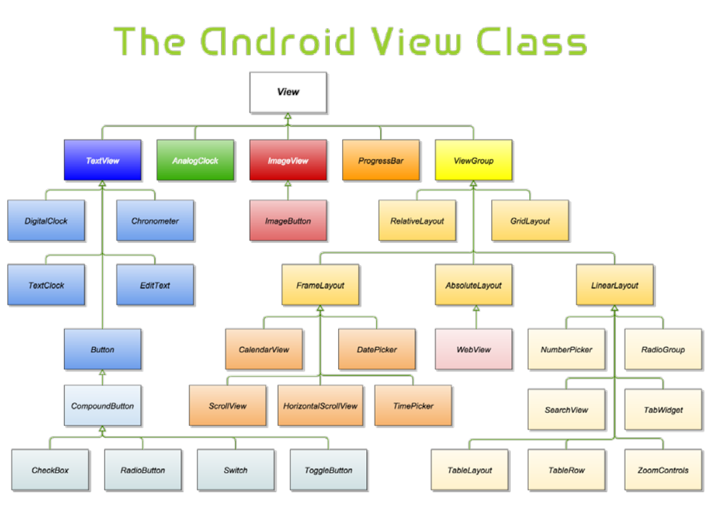

# 사용자 인터페이스 기초

- `View`
    - = `컨트롤` or `위젯`
    - 사용자 `UI` 구성하는 기초적인 빌딩 블록
    - `View`class 상속받아 작성된다.
    - 모든 `Widget`들과 `Layout`들의 최상위 클래스이다.
    

- `ViewGroup`
    - 다른 뷰들을 담는 컨테이너 기능
    - `ViewGroup`클래스에서 상속받아 작성됨
    - 흔히 `layout(레이아웃)`이라 불린다
        - `LinearLayout`
        - `RelativeLayout`
        - `TableLayout`
        - ...

------------------------------------------
- `View`의 필드와 메소드
     - `id`: `View`의 식별자
     - `view`의 크기 단위
        - `px`
        - **`dp(density-independent pixels)`**
            - `dp` = `px`*160/screen density
            - 160dp = 1인치
            - 
        - **`sp(scale-independent pixels)`**
            - 폰트크기 지정하는 경우 추천
        - ...

    - `화면 보이기 속성`
        - `visible(0)` : 보이게한다. 디폴트
        - `invisible(1)` : 표시되진 않지만 배치에서 공간을 차지한다.
        - `gone(2)` : 완전히 숨겨진다.

    - `마진과 패딩`
        - `패딩`: 뷰의 경계와 뷰의 내용물 사이의 간격
        - `마진`: 자식 뷰 주위의 여백

------------------------------------------
- `안드로이드에서 이미지 사용`
    - `/res/drawable/` 폴더에 이미지를 넣고, `ImageView`에서 `src속성`에 해당 이미지를 지정해준다. (`android:src="@drawable/[이미지이름]"`)

