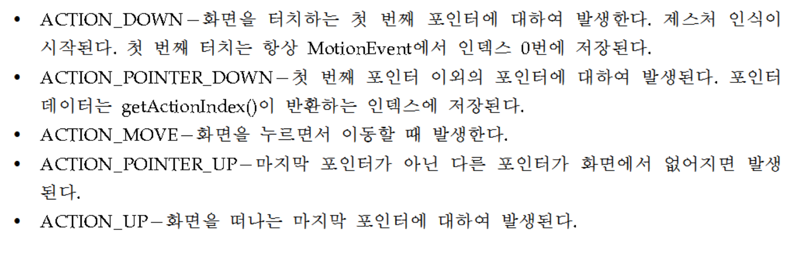

# 이벤트 처리

CSRP TDR: 크스리피 텐더
`Affinity`
`Flag`

------------------------------------------
- `입력 위젯`
    - `Button`
        - `커스텀 버튼`: 버튼 위에 텍스트 대신 이미지가 그려져 있는 버튼
            - 버튼 xml을 생성 후, `<selector><item></item></selector>`으로 이미지 정의 내린다.
            - 이후 `layout/레이아웃이름.xml`에서 `<Button android:background="@drawable/android_button"/>` 이렇게 정의 한다.
    - `Text field`
    - `Checkbox`
        - 사용자에 의하여 토글될 수 있는 on/off 스위치
    - `Radio button`
        - 체크박스와 비슷하지만 그룹에서 하나의 옵션만 선택할 수 있다.
    - `Toggle button` : 라이트 인디케이터가 있는 on/off 버튼
    - `Spinner` : 여러 값 중에서 하나를 선택할 수 있는 드롭다운 리스트
    - `Pickers`
        - `DatePicker`
        - `TimePicker`

------------------------------------------
- `폴링` vs `이벤트` 
    - `polling`: 대기하다 작업이 일어나는 즉시 처리
    - `event-driven`: 이벤트가 발생했을 때, 처리
    - `c.f`
    > 시스템 내에 동작 중에 폴링 방식과 이벤트 방식이 있다. 폴링 방식은 어떤 상태인지를 주기적으로 확인해보는 것이다. 폴링 방식을 예를 든다면 우편물이 왔는지를 매번 내가 가서 보는 것이다. 이렇게 매번 오가는게 폴링이다. 주기적으로 알아보는 만큼 오지 않았을 때 나가보는 동안 비효율이 발생을 한다.
    
    > 이벤트 방식은 어떤 상태가 되면 알려주는 것이다. 매번 가는 것이 아니라 우편물이 도착했을 때 문자를 보내는 것이다. 훨씬 효율적일 수 있다. 이벤트 방식로 해당 사람이 오면 알려 주는 방식이다. 두 방식에는 차이가 있지만, 언듯 폴링 방식은 비효율적일 거 같다는 생각을 할 수 있다. 하지만 정기적으로 뭔가를 감시하거나 검사를 해야 한다면 폴링방식도 필요할 것이다. 하지만 이벤트 방식을 통해서 트리거를 발생 시켜서 인지를 하게 되면 그 비효율이 줄어들어서 효율적으로 처리 할 수 있다.
    > 시스템 내에서는 대개 이벤트 방식으로 처리를 하게된다. 이벤트가 발생되면 인터럽트와 같이 하던 일을 중단 시키고 그 해당 이벤트가 원하는 일을 해주기도 한다.

------------------------------------------

- `이벤트 처리 방법`(3)
    - **1)** xml 파일에 이벤트 처리 메소드를 등록
        - 레이아웃 안의 `<button>` 요소에 `onClick()` 속성 추가 후 메소드를 정의 하면 된다.
    - **2)** 이벤트 처리 리스너객체를 생성 후 컴포넌트에 등록
        - 리스너 객체 생성 법(3)
            - 1. 리스너 클래스를 `inner class`로 정의
            - 2. 리스너 클래스를 무명 클래스(`anonymous class`)로 정의
                - `anonymous class`란 클래스 몸체는 정의되지만, 이름이 없는 클래스
                - `button.setOnClickListener(new OnClickListener() {}`
                - 클래스를 정의하면서 동시에 객체를 생성한다.
                - **내부 클래스에서 접근하는 외부 지역변수는 반드시 `final`이어야 한다.** 
                    > **이유 : `final을 붙이지 않으면 thread-safe하지 않기 때문에`**

                    > ` 생성된 이벤트 리스너 객체는 onCreate()가 종료된 후에도 살아있을 수 있는데 이런 상황에서, 리스너가 부착된 뷰 위젯 변수가 변경 된다면 원치 않는 위젯에서 이벤트가 발생할 수 있다.` 
            - 3. 리스너 인터페이스를 액티비티 클래스에 구현
                - `public class [액티비티이름] extends AppCompatActivity implements OnClickListener{}`

    - **3)** 뷰 클래스의 이벤트 처리 메소드를 재정의
        - 커스텀 뷰를 작성하는 경우
------------------------------------------

- `invalidate();`
    - 화면 다시 그리는 함수
    - `onDraw()`이후에 다시 그리고 싶을때, invalidate를 쏴준다.
------------------------------------------
- 그림판 view 만드는 법
    - `ACTION_DOWN`이벤트에서 getX,getY  -> `ACTION_MOVE`일때 `drawLine`
------------------------------------------
- `멀티 터치`
    - 여러 개의 손가락을 이용하여 화면을 터치하는 것
    - 이미지를 확대/축소할 때 많이 사용된다.
    - `인덱스와 아이디(index and id)`
        - `index`: 터치 포인트 갯수에 따라서 변화한다.(변화 o)
        - `id` : 고유 번호(변화하지 않는다.)
    - `터치 이벤트`
        

    - `핀치줌`
        - 두 손가락으로 벌리고 좁힘으로써 화면을 확대, 축소 하는 기능
        

------------------------------------------
    

