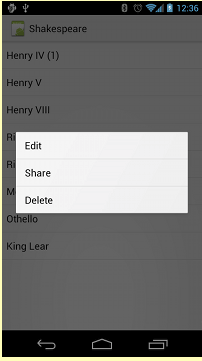
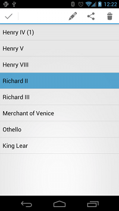
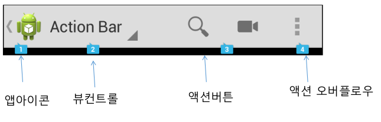
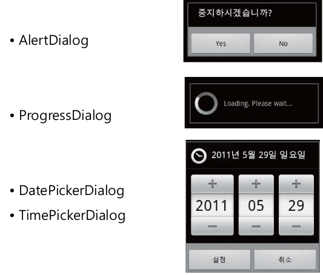
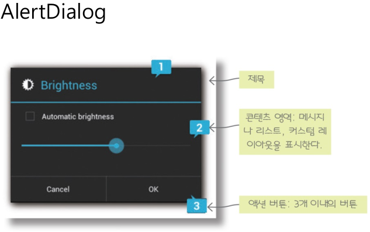
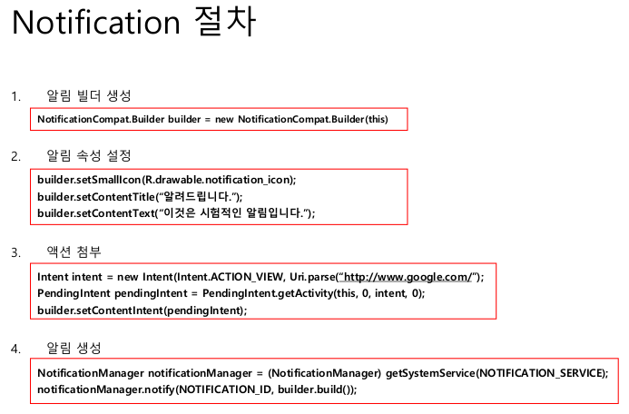

# 메뉴와 대화상자

- 안드로이드의 사용자 인터페이스
    - `네비게이션 바`
    - `액션바`
    - `다중 패널 레이아웃`
    - `제스처`

------------------------------------------
- 메뉴를 xml로 정의
    - **`<menu></menu>`를 할경우, 반드시 root 노드이어야 한다.**
    - 한개 이상의 `<item>` or `<group>`을 포함해야 한다.
        - `<item>`: 한개의 메뉴 항목을 나타냄
    - `androidLshowAsAction=""`: 어떤 action으로 메뉴 아이템이 보여질지 명시
- **`inflate`**
    - xml 파일을 읽어서, 실제 `자바 객체`로 만들어주는 것을 `inflate`라고 한다.

- 메뉴의 종류
    - `Option Menu`
        - Menu 키 누를 때 나타남
        - 현재 `액티비티`와 관련된 동작
    - `Context Menu`
        - 사용자가 화면을 일정 이상으로 길게 누르면 나타나는 메뉴
        - `UI`의 어떤 항목과 관련된 동작
        - 종류
            - `플로팅 컨텍스트 메뉴`: 마우스 우클릭 같은 개념
                 

            
            - `컨텍스트 액션 모드`
                - 현재 선택된 항목에 관련된 메뉴가 액션바에 표시된다. 여러 항목을 선택하여 특정한 액션을 한꺼번에 적용할 수 있다

                 

    - `Popup Menu` : 팝업 메뉴
        - 서브 메뉴의 역활
    

------------------------------------------
- `액션바`
    - 애플리케이션 로고 표시
    - 탭이나 드롭다운 
    - `ActionBar구성`
        - `App Icon` : 앱의 아이콘이 나타나는 부분
        - `View Control` : Navigation Mode 지정으로 List Navigation, Tab Navigation을 제공하지만 API Level 21부터 deprecation
        - `Action Button` : 사용자 액션을 위한 버튼
        - `Overflow Meun` : 표시가능한 버튼이 제한적이므로 표시가 안되는 버튼을 메뉴를 따로 만들어서 나타낸다.
        

------------------------------------------

- `대화상자`
    - 사용자에게 메시지를 출력하고 사용자로부터 입력을 받아들이는 아주 보편적인 사용자 인터페이스
    

    

------------------------------------------
- `알림(Notification)`
    - 어떤 이벤트가 발생하였을 때, 앱이 사용자에게 전달하는 메시지이다.
    

