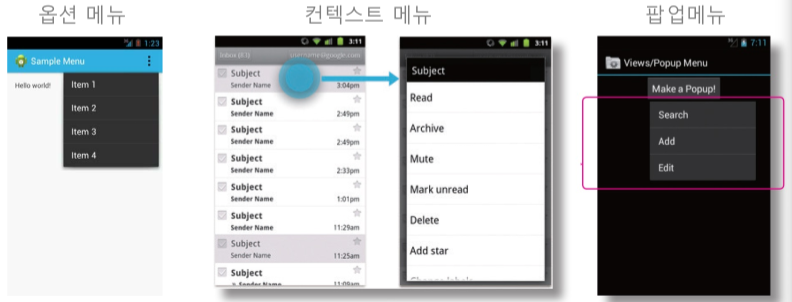

# 메뉴와 대화상자

- 안드로이드의 사용자 인터페이스
    - `네비게이션 바`
    - `액션바`
    - `다중 패널 레이아웃`
    - `제스처`

- 메뉴의 종류
    - `Option Menu`
    - `Context Menu`
    - `Popup Menu`
    

- `inflate`
    - xml 파일을 읽어서, 실제 인터페이스를 만들어주는 것을 `inflate`라고 한다.