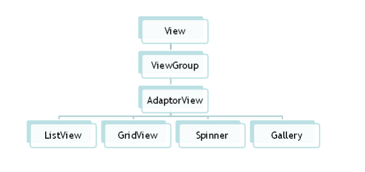
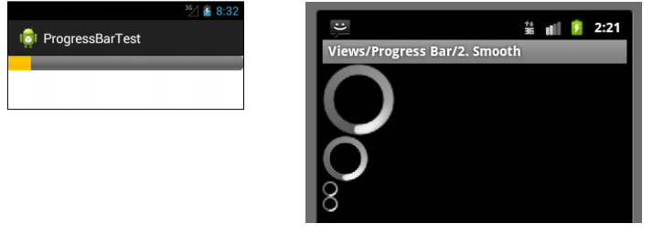
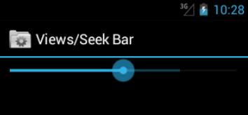
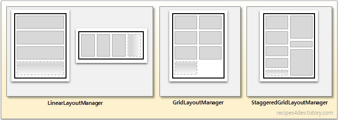
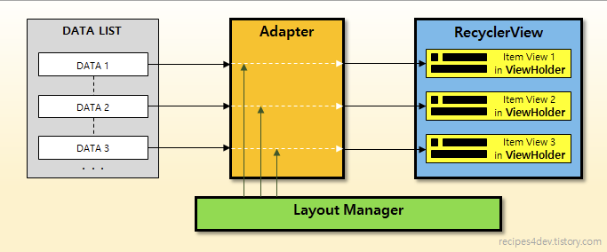
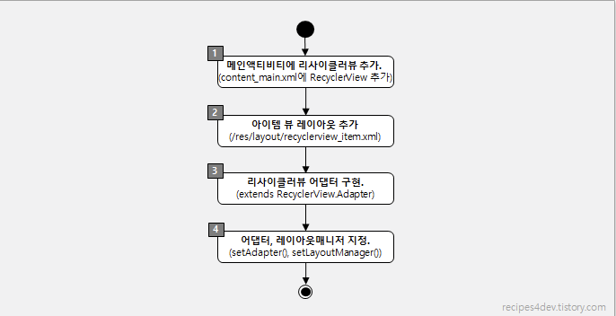

# 고급 위젯과 프래그먼트


- `어댑터 뷰`
    - `리스트 뷰`
    - `그리드 뷰`
    - `기타`
        - `Spinner(스피너)`
        - `Progress Bar(프로그레스 바)`
        - `SeekBar(시크바)`
        - `RatingBar`

- `Fragment(프래그먼트)`
    - `생애 주기`
    - `서브 클래스`
    - `Dynamic Fragment(동적 프래그먼트)`

- `RecyclerView`


# `어댑터 뷰`
> 어댑터 뷰(AdapterView)는 배열이나 파일, 데이터베이스에 저장된 데이터를 화면에 표시할 때 유용한 뷰


- `리스트 뷰`
- `갤러리`
- `그리드 뷰`
- `스피너`

<p align="center"></p>

## `리스트 뷰`

- `onListItemClick()`
- `R.array.[데이터배열class이름]`
- `getView()`
- `list.setAdapter(adapter);`
- `inflater`

## `그리드 뷰`

## `기타`
### `Spinner(스피너)`
> 항목을 선택하기 위한 드롭다운 리스트
### `Progress Bar(프로그레스 바)`
> 작업의 진행 정도를 표시하는 위젯

<p align="center"></p>

### `SeekBar(시크바)`
> 프로그레스 바의 확장판( 프로그레스 바 + thumb)
- `thumb` : 사용자가 드래그할 수 있는 밑에 요소

<p align="center"></p>

### `RatingBar`
> 별을 사용하여 점수를 표현하는 위젯

`설정하는법`


# `Fragment(프래그먼트)`
## `생애 주기`
## `서브 클래스`
- `DialogFragment`
- `ListFragment`
- `PreferenceFragment`
## `Dynamic Fragment(동적 프래그먼트)`

```java
FragmentManager fm = getFragmentManager(); // < API 28
FragmentManager fm = getSupportFragmentManager(); // >= API 28
Fragment fr = new FragmentA();
FragmentTransaction fragmentTransaction = fm.beginTransaction();
fragmentTransaction.addToBackStack(null);
fragmentTransaction.replace(R.id.fragment_container,fr);
fragmentTransaction.commit();
```

# `RecyclerView`
> ListView + Recycle

- [참고자료](https://android.jlelse.eu/understanding-recyclerview-a-high-level-insight-part-1-dc3f81af5720)
- [읽어볼거리](http://dudmy.net/android/2017/06/23/consider-of-recyclerview/)

- `View-Holder`패턴 + `Adapter`패턴
- `ListView`와 달리 `recyclerView`는 `View`를 screen 크기에 비례하여 만들고, 데이터는 `Holder`(데이터,tag_position)에 저장한다. 이후 scroll에 따라서 `view`를 `recycle`한다. (**100개의 item이 필요하면 listview는 100개의 view를 create 하고, findViewById를 100번 이상하지만, recycler 뷰는 scroll 크기만큼 정도의 view를 만들고, findviewbyId대신에 해당 `position`에 있는 holder를 그저 recycle된 `view`에 부착한다.**)
- 이후 `scroll`에 따라서 screen-off && 가장 오래된 `View`를 보여질 view로 사용하고 여기에 `Holder`데이터를 `bind`시켜준다.

- **Q) 과연 recycle되는 것은 row의 데이터 일까 row의 xml 형식일까?**
    - scroll-up 시켰을 때 지워졌던 데이터들은 새로 만들어지는가, 아니면 지워지지 않고 단지 GONE 시킨 것일까? 
    ```java
    recyclerView.setHasFixedSize(true);
    recyclerView.setItemViewCacheSize(20);
    recyclerView.setDrawingCacheEnabled(true);
    recyclerView.setDrawingCacheQuality(View.DRAWING_CACHE_QUALITY_HIGH);
    ```
    - `recyclerView`는 holder를 recycle하지, data를 recycle하지 않는다. 다만 `setItemViewCacheSize`를 하여 view를 cache 시킬 수 있다.


- `ListView`의 단점
    - 리스트 항목이 갱신될 때마다, 매번 아이템 뷰를 새로 구성해야 한다.
    - 수직(vertical)방향으로만 나열 가능
    - 아이템뷰를 `Dynamic`하게 구성 어렵다.
- **`RecyclerView의 특징`**
- `vertical`,`horizontal`,`Grid` 모두 사용가능하며, 커스터마이징 가능
- `Layout Manager`를 활용하여, `아이템 뷰`가 나열되는 형태를 관리

- `Layout Manager`가 제공하는 레이아웃 형태로, `Adapter`를 통해 만들어진 각 `ItemView`는 `ViewHolder`객체에 저장되어 화면에 표시 되고 `recycle`된다.

- **`RecyclerView`구성요소**

    - `RecyclerView`
        - `android.support.v7.widget.RecyclerView`
        - 사용자 `DataList`를 `특정 형태`(레이아웃매니저가 세팅)로 화면에 표시하는 컨테이너 역할
    - `Adapter`
        - `android.support.v7.widget.RecyclerView.Adapter`
        - 사용자 `DataList`로 부터 `itemView`를 생성
        - `onBindViewHolder()`
            - `scroll`에 따라서 `off-screen`된 `view`는 앞으로 나올 데이터로 바뀌어 부착되어 recycle 된다. 
            - 100개의 list를 보여주어야 한다 했을때, 모든 아이템을 update하는 것이 아닌, 화면에 보여질 정도의 데이터만 update해주고 scroll에 따라서 다시 update를 진행한다.
    - `LayoutManager`
        - `android.support.v7.widget.RecyclerView.LayoutManager`
        - `ItemView`가 어떠한 형태로 배치될 것인지를 결정

        <p align="center"></p>

    - `ViewHolder`
        - `android.support.v7.widget.RecyclerView.ViewHolder`
        - 화면에 표시될`ItemView`에 들어갈 데이터를 저장하는 객체
        - `RecyclerView`가 `recycle`하는 것은 `ViewHolder`이다.
        - `recycle`시 단순히 `데이터`가 `Item View in `에 `Binding`된다.

    <br/><br/>
    <p align="center"><strong>리싸이클러 뷰</strong></p>
    <p align="center"></p>
    <br/><br/>

    <p align="center"><strong>리싸이클러 뷰 기본 사용법</strong></p>
    <p align="center"></p>

- 이해안가는 것 
    - 리싸이클 뷰는 holder에 view를 단지 부착하는데, clear되는 view는 holder 클래스 안에 저장이 되는가?
    - 예를 들면 100개의 이미지 리스트를 보여준다고 할 때, inflate() *100의 데이터가 holder에 저장이 될까? (holder와 view 모두 recycle 되는가)

    - 화면 크기만큼 holder가 생성되고, scroll에 따라서 holder가 사용된다고 생각했는데, 위와 같이 holder에 데이터가 저장이 되어있다면, 어떠한 홀더에 어떤 view가 저장됬는지 기록하고 있어야할텐데 그런식으로 처리될까? 이럴경우 갑자기 화면이 커지거나 그러면 같은 holder에 저장된 다른 view들이 화면에 보여져야 할때 같은 instance를 못쓰니까 문제가 생기지 않을까? 


- `해결책` : `ViewHolder`(데이터 holder) kept above the screen (not visible to user),holder는 cash되어 그대로, `view`(접시)가 recycle 된다.


