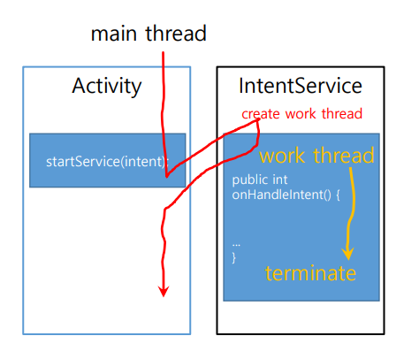

# 서비스와 방송수신자

#### 서비스 종류
- 외부 서비스
- 내부 서비스
    - `started service`
        - `startService()`
    - `bound service`
        - `biindService()`

- `AndroidManifest.xml`에 
```xml
<service>
    android:enabled="true" // 안드로이드 시스템이 자동적으로 서비스를 시작하게 해준다.
    android:name=".서비스이름"
</service>
```

- 서비스를 시작하는 가장 기본적인 방법
    - `startService()`호출
    - 매개변수로 `intent`전달
    - `intent`에 어떤 서비스를 시작할 것인지를 기술
    - ex) `startService(new Intent(this,MusicService.class));`
    - ex) `stopService(new Intent(this,MusicService.class));`


#### `Service` vs `IntentService` 클래스

- `Service Class` 
    - `MainThread`에서 onStartCommand()를 실행함.
    - 메인 스레드에 부담을 줄 수 있다.
        -`해결법` : 서비스 내에서 새로운 작업 `thread`를 생성하여 해당 작업 실행을 맡김
    - 네트워크를 통한 데이터 통신 서비스의 경우, `NetworkOnMainThread Exception`발생을 주의해야 한다.
    
<p align="center"></p>

- `IntentService Class`
    - 시작 요청이 들어올 때마다 이것을 처리하는 작업 스레드를 별도로 생성
    - `onStartCommand()`대신에 `onHandleIntent()`에 서비스 기능 구현

    <p align="center"></p>


    - 사용방법
        - `MainActivity`
            1. `new Handler()`생성

            <p align="center"></p>

            2. `new Intent(this,Service이름.class)`
            3. `new Messenger(handler)`
            4. `intent.putExtra("MESSENGER",messenger)`
            5. `startService(intent)`
            <p align="center"></p>

        - ` 내서비스 extends IntentService`
            1. `@override onHandleIntent(Intent intent){}`
            2. `Bundle extras = intent.getExtras();`
            ```java
            public class myService extends IntentService{
                ...
                @Override
                // Intent를 전달받아, 처리를 해준다.
                protected void onHandleIntent(Intent intent){
                    ...
                    Bundle extras = intent.getExtras();
                    if (extras != null){
                        Messenger messenger = (Messenger) extras.get("MESSENGER");
                        Message msg = messenger.obtain();
                        ...

                        try{
                            // handleMessage(Message message)로 메세지가 보내진다.
                            messenger.send(msg);
                        }catch (android.os.RemoteException e1){
                            ...
                        }
                    }
                }
            }
            ``` 

            - `Messenger`:
            > Messenger 는 특정 Handler 인스턴스의 리퍼런스를 갖고 있으며, 이를 이용하여 해당 Handler 로 메세지를 보낼 수 있습니다. 이를 이용하여, 프로세스간 메세지 기반 커뮤니케이션을 수행할 때 활용될 수 있습니다. 

            - 특정 Handler 를 감싸는 클래스

            - Handler 자체는 다른 프로세스로 넘겨 줄 수 없지만, 이를 Messenger 로 감싸면, 해당 Handler 로 원격에서 메세지를 전할 수 있는 Messenger 인스턴스를 생성할 수 있고, 이 Messenger 인스턴스는 한 프로세스에서 다른 프로세스로 이동 할 수 있다.


            - `Handler`:
                >  Handler 를 통해 서로 다른 스레드 간에 메세지를 주고 받을 수 있습니다. 

                1) `Message` object
                2) `Runnable` object 이 두가지를 처리한다.
                - `Handler's sendMessage()` -> `MessageQueue` -> `Looper` -> `Handler` -> `handleMessage()`
                
                - `@override handleMessage()`: 메시지 처리하는 루틴 구현
                - `Handler`:
                    - 혼자서 존재할 수 없다.
                    - 메세지가 들어가는 입구이자 출구역활
                    - `외부 thread`에서 `sendMessage()`
                        - ex) `new Handler().sendMessage();`
                        - 기본 생성자를 통해 `Handler` 를 생성자면, 새롭게 생성된 `Handler` 는 해당 `Handler` 의 생성자가 호출된 바로 그 스레드의 `MessageQueue` 그리고 `Looper` 에 자동으로 연결됩니다.
                    - `handler의 내부 스레드`에서 `obtainMessage()`
                    - handler 에서 `handleMessage()`
                - `MessageQueue`: handler에 들어온 message or Runnable들을 넣어두는 queue
                - `Looper`: MessageQueue 에서 message를 빼서 Handler로 전달해준다.
                - **결과적으로 모든 Handler 는 항상 특정 스레드와 연결되어 있어야 하며, 그리고 그 스레드는에는 메세지를 담을 수 있는 MessageQueue 와 해당 메세지를 Handler 로 전달해줄 Looper 가 존재해야 합니다.**


        - `IBinder`
        - `IntentFilter`

#### 방송수신자
> 안드로이드 장치에서 발생하는 다양한 이벤트들을 받는 컴포넌트
- `receiver`
     ```java
    public class MyReciever extends BroadcastReceiver{
        @Override
        public void onReceive(Context context, Intent intent){
        }

    }
    ```


            
