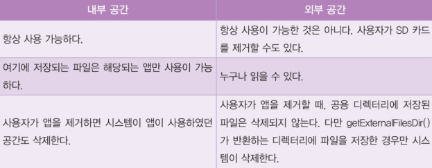

# 데이터베이스

- 데이터 저장법
    - `Shared Preferences`(공유 프레퍼런스)
        - (key-value pair)
        - 간단한 값 저장에 DB를 사용하기에는 복잡하기 때문에 SharedPreferences를 사용하면 적합하다.
        - 어플리케이션에 파일 형태로 데이터를 저장한다.
        - `app` 삭제되기 전까지 보존된다. (`BACK`을 누르더라도 문자열이 없어지지 않는다.)

    - `Internal Storage`
        - `app` 삭제되기 전까지 보존된다. (`BACK`을 누르더라도 문자열이 없어지지 않는다.)
        - 내부 저장 공간의 파일은 해당 애플리케이션만 접근이 가능
        - `File` 형식으로 읽고 쓴다.
        

    - `External Storage`
    - `SQLite 데이터베이스`
        - `Result Sets`
        - `Cursor`
            - 모든 SQLite 쿼리는 쿼리를 통해 찾은 모든 행을 가리키는 Cursor를 반환합니다. Cursor는 항상 데이터베이스 쿼리에서 결과를 탐색하고 행과 열을 읽을 수 있는 메커니즘입니다.
        - `SQLiteOpenHelper`
        
    - `웹서버(네트워크 연결)`

